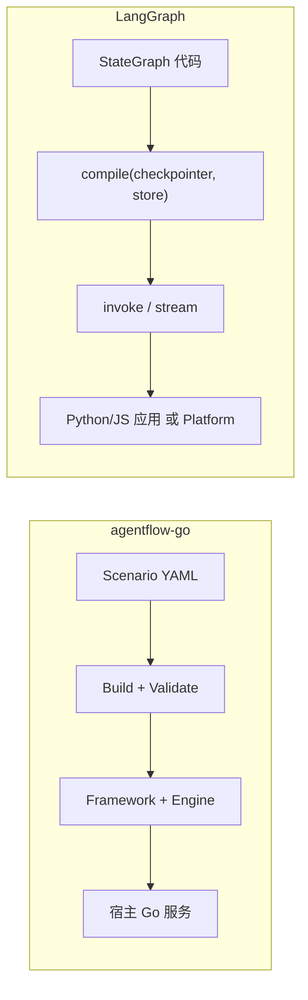

# agentflow-go vs LangGraph 全面对比

本文档专做 **LangGraph** 深度横向对比。多框架矩阵见 [competitive-analysis.md](./competitive-analysis.md)。

> 基准：agentflow-go v0.1.10；LangGraph v1.2.x（Python，2026-05 文档）。

---

## 1. 一句话定位

| | agentflow-go | LangGraph |
|---|-------------|-----------|
| **是什么** | 可嵌入 Go 服务的场景驱动 Agent **运行时库** | Python/JS 有状态 Agent **编排底层框架** |
| **配置中心** | Scenario YAML（+ `pkg/builder` Go DSL） | Python/TS **代码**定义 `StateGraph` |
| **产品形态** | `import` 库 + 宿主自建 HTTP/Worker | 库 + **LangSmith Studio / LangGraph Platform** |
| **典型用户** | 已有 Go 后端、重视治理/合规 | Python AI 团队、LangChain 生态 |

---

## 2. 架构对照



| 维度 | agentflow-go | LangGraph |
|------|-------------|-----------|
| 抽象单元 | Scenario → Agent / Tool / Skill / Workflow | Graph → Node / Edge / State channels |
| 编排入口 | `orchestration.mode`：`autonomous` / `fixed_workflow` / `hybrid` | 单一图模型，模式靠拓扑表达 |
| LLM 集成 | `pkg/llm` Gateway，Provider 无关 | 深度绑定 **LangChain** |
| 语言 | **Go only** | **Python 为主**，LangGraph.js |

---

## 3. 编排模型

### 3.1 顶层模式映射

| agentflow-go | LangGraph 等价 | 说明 |
|--------------|----------------|------|
| `autonomous` | ReAct / tool-calling loop | 可选 `planning` pass |
| `fixed_workflow` | 确定性 DAG | AF 内置 RAG 节点（`query_router`、`rag_grade`）等 |
| `hybrid` | workflow 子图 → hydrate → autonomous 子图 | AF 一等 `RunHybrid` |

LangGraph 无内置「三模式」；需 subgraph + conditional edges 组合。

### 3.2 图表达能力

| 能力 | agentflow-go | LangGraph |
|------|-------------|-----------|
| 条件分支 | workflow `condition`、`query_router` | `add_conditional_edges` |
| 并行 | `parallel_group` | 同 super-step 多节点 |
| 循环 | `loop`（有界） | 回边 / `Send` 动态 fan-out |
| 子图 | Skill **编译期** inline | **运行时** subgraph |
| 动态路由 | 有限 | **Send**、动态边更强 |
| Supervisor | `supervisor` 节点 + `sub_agents` delegate tool | prebuilt / 自定义 |

**LangGraph 优势**：图灵完备、time-travel 调试、Studio 可视化。

**agentflow-go 优势**：YAML 可审阅、JSON Schema + CI 校验、企业可读的 tool 契约。

### 3.3 Skills 语义

| | agentflow-go | LangGraph |
|---|-------------|-----------|
| 复用单元 | Skill = prompt/policy/tool policy/workflow 片段 | 子图 / prompt template / tool 列表 |
| 运行时 | **Build 期展开**，非 Actor | subgraph 运行时一等公民 |

---

## 4. 状态与持久化

| | agentflow-go | LangGraph |
|---|-------------|-----------|
| 快照 | `RunSnapshot`（RunState） | `StateSnapshot`（checkpoint） |
| 键 | `run_id` + CAS `version` | `thread_id` + checkpoint id |
| 并发 | **CAS** `ErrStaleSnapshot` | 单调 checkpoint id |
| 大输出 | **BlobStore** 外置 | 通常进 checkpoint（需自建外置） |
| 失败容错 | Job 重试 + RunState | **pending writes**（同 super-step 不重算） |
| Time travel | 恢复 pause 点 | **逐步回放** + Studio |

**后端**：AF 支持 inmem / file / Postgres / Redis RunState；LG 提供 InMemory / Sqlite / Postgres Saver。

**差异要点**：AF 将 **RunState 与 Memory 分离**；LG checkpoint 模型对长图容错与对话 thread 更成熟。

---

## 5. 记忆

| 类型 | agentflow-go | LangGraph |
|------|-------------|-----------|
| 短期 | session/conversation scope → LLM 注入 | state messages + checkpointer |
| 长期 | tier hot/warm/cold + `memory.reconcile` job | **Store**（namespace + key JSON） |
| 语义检索 | CognitiveMemory + DualWriteManager | PostgresStore + pgvector index |
| 配置 | YAML `memories.*.tiers` | `compile(store=store)` |

---

## 6. 工具与 MCP

| 维度 | agentflow-go | LangGraph |
|------|-------------|-----------|
| 声明/执行 | YAML manifest + `WithToolExecutor` / `WithToolResolver` | LangChain Tool 绑定 |
| MCP | `scenario.mcp.servers` + `WireMCPTools` | LangChain MCP 适配 |
| 可选治理 | side_effect / approval / RBAC（按需启用） | 自建 |

编排对齐优先；工具治理为附加能力，见 [orchestration-parity.md](./orchestration-parity.md)。

---

## 7. RAG

| 维度 | agentflow-go | LangGraph |
|------|-------------|-----------|
| 端口 | `pkg/knowledge` + workflow RAG 节点 | retriever + 自定义 node |
| 模板 | `adaptive_rag` / `corrective_rag` / `self_rag` YAML | 官方教程图 |
| Hybrid 检索 | Postgres FTS + vector RRF | 生态组合 |

关闭进度见 [competitive-analysis.md](./competitive-analysis.md)。

---

## 8. Human-in-the-Loop

| | agentflow-go | LangGraph |
|---|-------------|-----------|
| 暂停点 | ① `before_final_answer` ② `tool.approval: pause` ③ `human_gate` | 节点内 `interrupt(payload)` |
| 恢复 | `ResumeAndContinue` + HMAC token（RunID+Version） | `Command(resume=...)` + `thread_id` |
| HTTP | `POST /v1/hitl/resume` | Platform / 自建 |

---

## 9. 可观测、安全、部署

| 维度 | agentflow-go | LangGraph |
|------|-------------|-----------|
| Trace/Metrics | OTel + Prometheus（根包） | **LangSmith** 一等 |
| RBAC/审计/租户 | **内建** | 需自建 |
| 异步 | Postgres/inmem JobQueue + Worker | Platform / Celery 等 |
| 托管 | 参考 Compose/K8s（非产品） | **LangGraph Platform** |

---

## 10. 能力总表

| 能力 | agentflow-go | LangGraph |
|------|:------------:|:---------:|
| 代码状态图 | ○ | ●●● |
| 自主 tool loop | ●●● | ●●● |
| Hybrid 两阶段 | ●●● | ●● |
| 运行时 subgraph | ●●● | ●●● |
| 动态 fan-out (Send) | ●● | ●●● |
| Checkpoint | ●●● | ●●● |
| Time travel UI | ●●● | ●●● |
| Graph 可视化（只读 Studio） | ●●● | ●●● |
| Tier / Store 长期记忆 | ●●● | ●●● |
| Agentic RAG 模板 | ●●● | ●●● |
| HITL | ●●● | ●●● |
| Go 嵌入 | ●●● | ○ |
| Python 生态 / Platform | ○ | ●●● |

●●● 强 / ●● 有 / ○ 弱 / 🔲 计划（见 [orchestration-parity.md](./orchestration-parity.md)）

---

## 11. 选型建议

**选 agentflow-go**：Go 服务内嵌、YAML/Builder 声明图、hybrid/RAG 模板、与 LangGraph 对齐的 subgraph 路线（[orchestration-parity.md](./orchestration-parity.md)）。

**选 LangGraph**：Python/LangChain 生态、LangSmith Studio、LangGraph Platform 托管、动态 Send + time-travel 已完全成熟。

**混合**：Go 运行时 + Python 实验，经 MCP / HTTP tools / event trigger 互调。

---

## 12. Side-by-side：多专家 Research（Hybrid + 并行）

同一业务：**并行多路分析 → 汇总 → 自主综合答复**（`builder.MultiExpertResearch()`）。

### 12.1 agentflow-go

```yaml
orchestration:
  mode: hybrid
  workflow:
    nodes:
      - id: experts
        kind: parallel_group
        input:
          refs: [macro, sector, finance]
      - id: synthesize_prep
        kind: transform
        depends_on: [experts]
  planning:
    execute: true
```

Phase-1 `parallel_group` 跑固定专家 Agent，Phase-2 hybrid 进入 autonomous + `planning.execute` 综合。

**运行时 subgraph（对齐 LangGraph nested graph）**：

```yaml
orchestration:
  mode: fixed_workflow
  workflows:
    experts:
      nodes:
        - id: macro
          kind: agent
          ref: macro_analyst
        - id: sector
          kind: agent
          ref: sector_analyst
  workflow:
    nodes:
      - id: run_experts
        kind: subgraph
        ref: experts
      - id: merge
        kind: transform
        depends_on: [run_experts]
```

### 12.2 LangGraph（等价思路）

```python
builder = StateGraph(State)
builder.add_node("experts", parallel_experts_subgraph)
builder.add_node("merge", merge_outputs)
builder.add_edge(START, "experts")
builder.add_edge("experts", "merge")
# hybrid 阶段：conditional edge → agent_loop 节点
graph = builder.compile(checkpointer=checkpointer)
```

### 12.3 对照小结

| Concern | agentflow-go | LangGraph |
|---------|-------------|-----------|
| 并行多专家 | `parallel_group` / `subgraph` | subgraph / Send |
| 后半段自主 | `hybrid` mode | 条件边 + agent 节点 |
| 图复用 | `orchestration.workflows` + `subgraph` | 编译 subgraph |
| 改拓扑 | YAML / Builder | Python 代码 |

---

## 13. 差距与路线图（编排优先）

完整阶段计划：[orchestration-parity.md](./orchestration-parity.md)

| 差距 | 状态 |
|------|------|
| 运行时 subgraph | ✅ |
| 动态 fan-out (`map` / Send) | ✅ Phase 2 |
| Checkpoint 列表 / 定点恢复 | ✅ Phase 3（含历史链 + Studio UI） |
| 图内 `agent_loop` | ⏸ 不做（用 `hybrid` + `autonomous`） |
| Studio 可视化 | ✅ Graph / Time Travel / Editor / Compare / Thread（含 undo、YAML 导出/导入、试运行） |

### agentflow-go 优势（非治理向）

- Go 生产栈一体嵌入
- Builder catalog（19 条 stack）与 `ValidateScenario` 对齐
- hybrid + RAG workflow 节点开箱
- Library-first，无 Platform lock-in

---

## 14. 相关文档

- [orchestration-parity.md](./orchestration-parity.md) — **LangGraph 编排对齐路线图**
- [competitive-analysis.md](./competitive-analysis.md)
- [orchestration-flow.md](./orchestration-flow.md)
- [builder-reference.md](./builder-reference.md)

---

## （归档）工单 HITL 示例

如需 event trigger + `before_final_answer` 示例，见 `builder.MinimalTicketHandling("support")`；不作为框架主定位。
