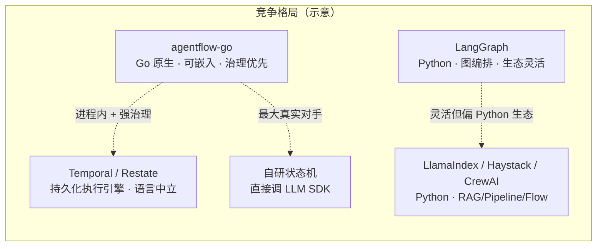

# 竞争力与市场定位

本文档回答两个战略问题：**agentflow-go 的竞争力在哪里**，以及 **固定工作流（`fixed_workflow`）是否是主流方案**。

它是对外叙事与销售/布道的依据，与下列文档互补：

- 能力差距与关闭进度：[competitive-analysis.md](./competitive-analysis.md)
- LangGraph 深度对比：[competitive-analysis-langgraph.md](./competitive-analysis-langgraph.md)
- 产品边界与裁剪：[product-direction.md](./product-direction.md)

---

## 一、一句话定位

> **agentflow-go 不是"更好的 LangGraph"，而是"让 Go 后端团队把 Agent 安全地放进自己的生产进程"的运行时库。**
>
> 竞争力来自**生态位的精准**（Go 原生 + 可嵌入 + 治理/可观测/可恢复），而非功能面的全面碾压。

---

## 二、定位象限

横轴：运行形态（外部托管平台 ↔ 进程内嵌入库）。
纵轴：重心（探索/原型灵活性 ↔ 生产治理与可靠性）。

要点：

- agentflow-go 与 **Temporal/Restate** 同处"生产可靠性"象限，但把 **LLM/工具/HITL/记忆做成一等公民**（在 Temporal 里这些都得自己拼）。
- 与 **LangGraph/LlamaIndex/CrewAI** 同属"Agent 框架"，但它们偏 Python 生态与灵活性，agentflow-go 偏**嵌入与显式治理**。
- 最容易被忽视、却最现实的对手是 **"我自己用 Go 手撸一个够用的状态机"**——叙事必须压过自研冲动。

---

## 三、竞争力分析

### 3.1 真正的护城河

1. **Go 原生 + 可嵌入运行时库**
   Agent 框架生态几乎被 Python 垄断（LangGraph、LlamaIndex、CrewAI、Haystack）。大量金融、基础设施、中间件、云厂商后端是 Go，要自嵌 Agent 时只能起 Python sidecar 或调外部平台——跨语言、跨进程，运维与延迟都难受。agentflow-go 提供 `import` 即用、`Framework.Run` 即跑、**无 Python 运行时**的路径。这个生态位真实存在且未被很好满足。

2. **"显式接线 + 治理优先"的工程心智**
   Gateway / ToolExecutor / RunState / EventSink 全由宿主控制（Hexagonal），叠加工具白名单、审批、RBAC、`AuditSink`、HMAC HITL、CAS 快照。奔着**进生产、过合规**去，而非 demo 框架——这恰是 Python 快速原型框架最薄弱处。

3. **完成度高**
   三种编排模式 + subgraph/map/loop/parallel、Checkpoint 时间旅行、Memory Tier（hot/warm/cold）、pgvector+FTS 混合检索、Prometheus/OTel、Studio 调试台、Helm/Compose 参考部署。对一个库来说面铺得很全，且持续做竞态/连接池/持久化加固，代码质量是认真的。

### 3.2 诚实的弱点

| 弱点 | 说明 | 应对 |
|------|------|------|
| 市场"小而真实" | Go 后端 + 自嵌 Agent + 重治理，三条件叠加后 TAM 比 Python 框架小一个数量级 | 接受定位换来的天花板，做深而非做宽 |
| 生态/心智份额 | 开发者找 Agent 框架默认搜 Python；最大对手其实是"自研" | 把"开箱即得的治理/可观测/可恢复"讲到足够痛 |
| LLM 能力面落后 Python | 新 provider、新范式几乎都先在 Python 落地 | 持续克制，不追全量 parity（见 product-direction） |
| Studio 维护负担 | 内置调试台是销售钩子，也是长期成本 | 明确它是核心卖点还是锦上添花，别拖累 runtime |

---

## 四、固定工作流是不是主流方案

**是，而且是当前生产环境最主流、最被推荐的一类。这点方向押对了。**

依据：

1. **行业已收敛出 "Workflows vs Agents" 的二分。**
   主流观点（如 Anthropic《Building Effective Agents》）明确区分：**Workflow = LLM 与工具走预定义代码路径**；**Agent = LLM 自主决定流程**。核心结论是——**绝大多数生产场景应使用 workflow 而非放养式 autonomous agent**，因为可预测、可测试、成本可控、可审计。`fixed_workflow`（确定性 DAG）正属此类。

2. **主流框架的底座都是图/工作流。**
   LangGraph 本质是状态图；LlamaIndex Workflows、Haystack Pipeline、CrewAI Flows 都是显式流程编排；工程侧 Temporal/Restate 这类持久化工作流引擎正被大量用于跑"可靠的 Agent"。**"确定性编排 + 关键节点插入 LLM/工具/人工"** 已是生产共识。

3. **三模式划分踩在共识上。**
   `autonomous`（探索/灵活）、`fixed_workflow`（生产/可控）、`hybrid`（工作流打底 + 局部自主）正是主流"光谱"表达。尤其 `hybrid` 最贴合现实：**固定骨架 + 个别步骤放一点自主**。

> **提醒**：fixed_workflow 这条赛道的真正强敌不是 LangGraph，而是 **Temporal / Restate** ——它们在崩溃恢复、长时运行、exactly-once 上更成熟。差异化要落在 **"工作流里 LLM/工具/HITL/记忆都是一等公民、且可时间旅行"**。Checkpoint/CAS/时间旅行能力要继续作为核心叙事。

---

## 五、结论与最高杠杆动作

| 维度 | 判断 |
|------|------|
| 整体竞争力 | 有且差异化清晰——靠"Go 原生可嵌入 + 治理/可观测/可恢复"立足，不靠功能全面 |
| 固定工作流 | 是主流，方向押对——生产级 Agent 普遍是 workflow 而非放养 agent |
| 最大风险 | 不是技术，而是生态份额 / 心智 / 被自研替代 |

三条最高杠杆动作：

1. **收窄叙事**：从"Agent 框架"收到 **"Go 生产 Agent 运行时"**——不与 Python 比广度，强调进程内、类型安全、合规可审计。
2. **杀手案例砸穿**：拿 1–2 个真实场景（金融风控审批流、运维 runbook 自动化、内部工单），用 `hybrid + HITL + audit` 讲一个 Python 框架讲不利索的故事。
3. **对标 Temporal 而非只对标 LangGraph**：把"工作流里 LLM/工具/人工/记忆皆一等公民、且可时间旅行"打磨成独有钩子。
