# Agent 编排逻辑流程图

本文档描述 agentflow-go 从 Scenario YAML 加载到 Run 完成的完整执行链路，涵盖 **Skills 展开、LLM 调用、Tools 执行、三种编排模式、HITL 暂停/恢复**，以及 **[编排模式与节点选型指南](#九编排模式与节点选型指南)**（各 mode / 节点适用场景）。

相关代码入口见文末「关键代码索引」。字段级说明见 [configuration-reference.md](./configuration-reference.md)。

---

## 一、总览：从 YAML 到 Run 完成

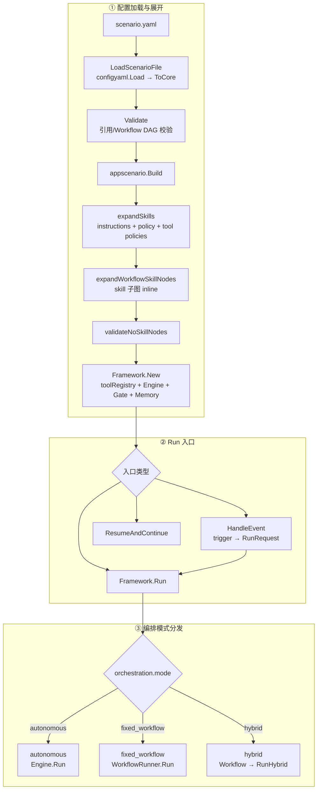

---

## 二、Skills 展开逻辑（Build 阶段）

Skills **不是运行时 Actor**，而是在 `Build` 时**编译进 Scenario**：

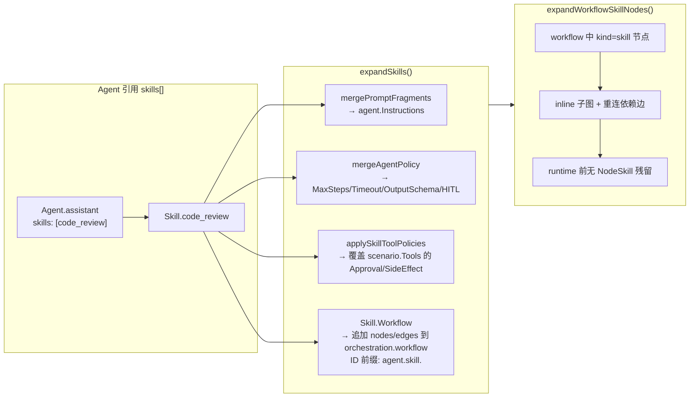

**要点：**

- Skill → **Prompt 片段 + Agent 策略 + Tool 策略 + 可选 Workflow 子图**
- Workflow 里的 `skill` 节点在 Build 时展开，运行时只认识 `tool / agent / human_gate / ...`

---

## 三、Autonomous 模式：LLM + Tools 核心循环

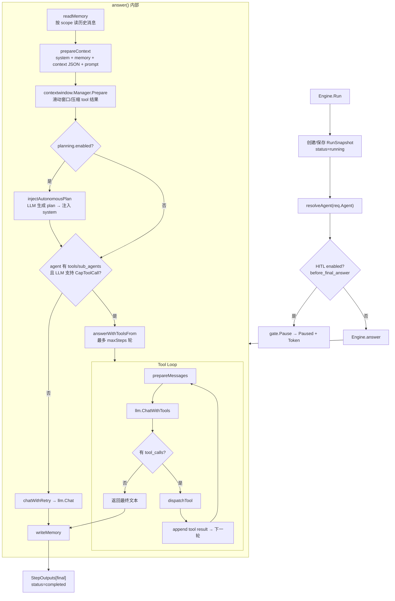

### dispatchTool 完整链路

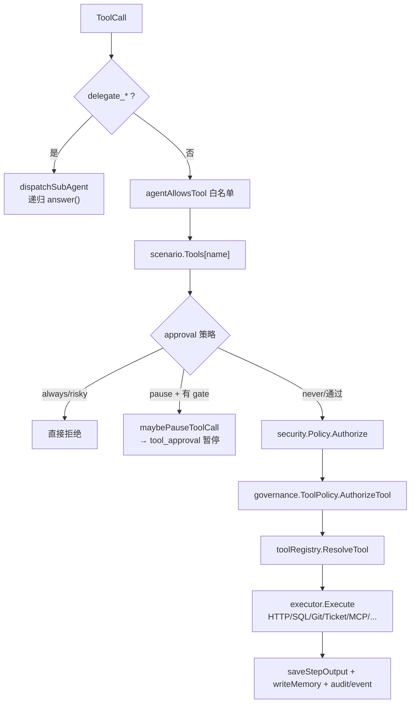

**Tool 解析优先级**（`toolRegistry.ResolveTool`）：

1. `WithToolExecutor` 显式注册（eager）
2. 缓存（cache）
3. `WithToolResolver` 动态解析

---

## 四、Fixed Workflow / Hybrid 模式

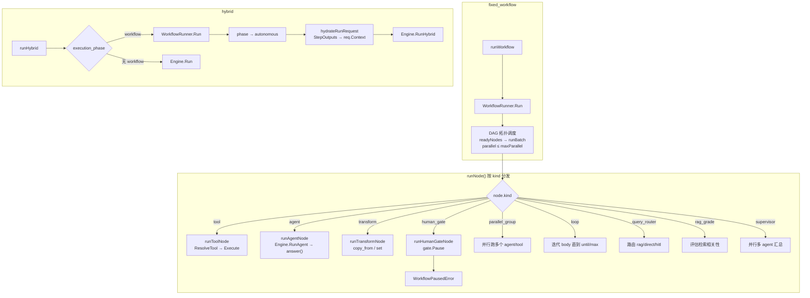

**Workflow 与 Autonomous 的区别：**

| | fixed_workflow / hybrid（阶段 1） | autonomous |
|---|---|---|
| 调度 | DAG 节点顺序/并行/条件边 | LLM 自主决定 tool_calls |
| LLM | 仅在 `agent` 节点调用 | 每轮 answer/tool loop |
| Tool | `runToolNode` 直接 Execute | `dispatchTool` 经 LLM 决策 |
| 输出 | 各 step 写入 `StepOutputs[nodeID]` | `StepOutputs["final"]` + `tool.*` |

---

## 五、LLM Gateway 调用链

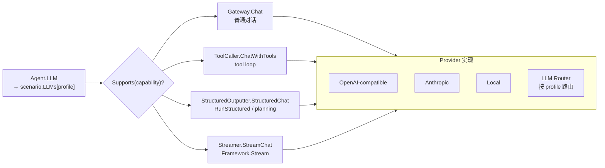

**消息组装顺序**（`prepareContext`）：

1. `system`: agent.Instructions（已含 Skill 展开的 prompt）
2. memory 历史（受 `memory_recall_limit` 限制）
3. `user`: Runtime context JSON（hybrid 阶段 2 含 workflow step outputs）
4. `user`: prompt

---

## 六、HITL 暂停与恢复

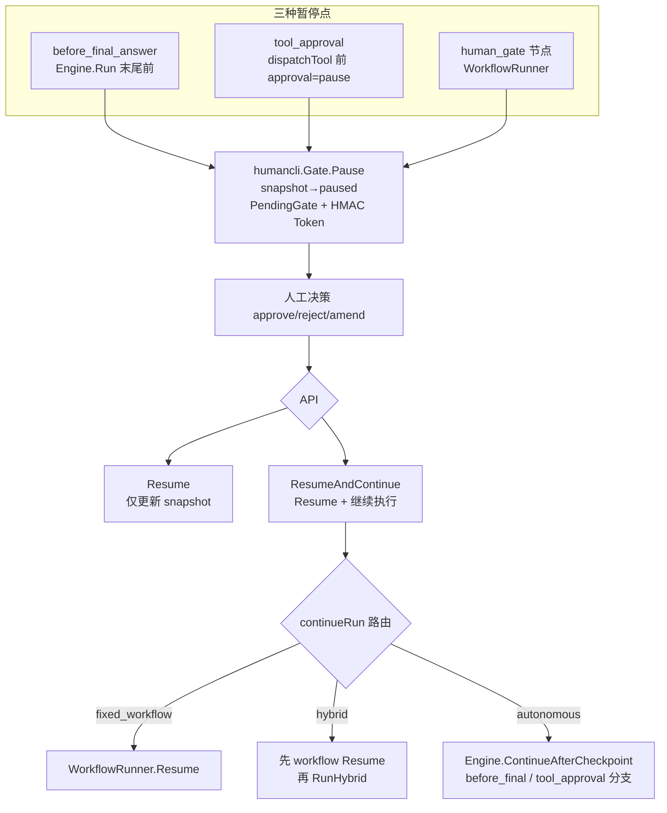

---

## 七、端到端时序（Autonomous + Tools + Skill 已展开）

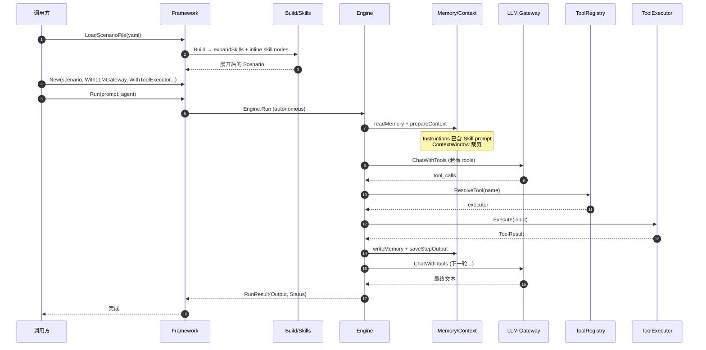

---

## 八、三种模式对比

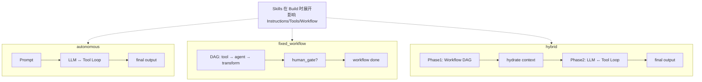

---

## 九、编排模式与节点选型指南

本节从**业务场景**出发，说明三种编排模式与各类 workflow 节点分别适合什么任务。执行链路细节见上文第一至八节；字段定义见 [configuration-reference.md](./configuration-reference.md)。

### 9.1 一分钟选型

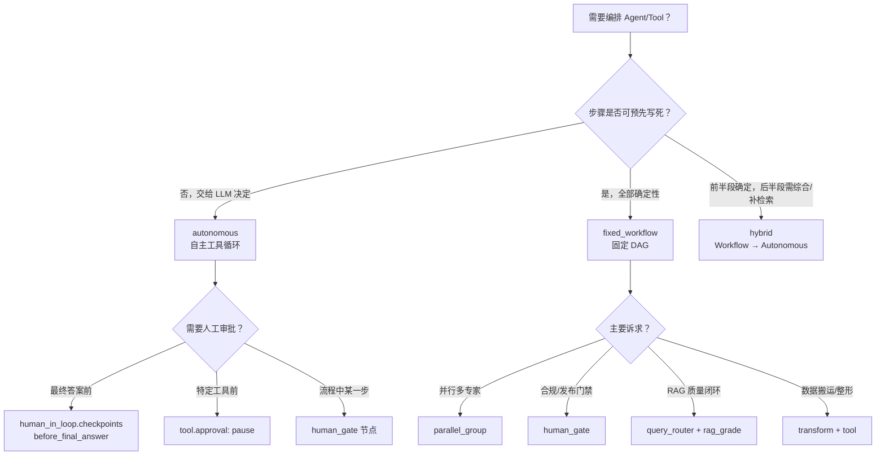

| 你的目标 | 推荐 mode | 常用节点 / 能力 | 示例 |
|----------|-----------|-----------------|------|
| 开放式问答、客服、工单处理 | `autonomous` | `planning`、memory、HITL checkpoint | `examples/autonomous.yaml`、`examples/ticket_handling.yaml` |
| 可审计的固定流水线（CI、审批链） | `fixed_workflow` | `tool` → `parallel_group` → `transform` → `human_gate` | `examples/code_review_pipeline.yaml` |
| 先收集结构化证据，再让 LLM 综合 | `hybrid` | Phase-1 `parallel_group` / `tool`，Phase-2 指定 agent | `examples/hybrid.yaml`、`examples/multi_expert_research.yaml` |
| 知识库问答，需控制检索路径 | `fixed_workflow` | `query_router`、`tool`(retriever)、`rag_grade` | `examples/adaptive_rag.yaml`、`examples/corrective_rag.yaml` |
| 多 Agent 分工且路由规则简单 | `fixed_workflow` | `supervisor` 或 `parallel_group` | `examples/multi_expert_research.yaml`（hybrid 变体） |

---

### 9.2 三种编排模式

#### `autonomous` — 自主模式

**适用场景**

- 用户问题开放、步骤无法预先枚举（通用助手、支持工单、Research Agent）
- 需要 LLM 根据上下文**动态选择**调用哪些工具、调用几次
- 配合 `triggers` 做事件驱动（Webhook → Agent Run）
- 需要 session / long-term memory 的多轮对话

**不太适合**

- 必须逐步审计、逐步留痕的强合规流水线（更推荐 `fixed_workflow` + `human_gate`）
- 所有步骤都应是确定性 API 调用、不希望 LLM 介入调度

**可叠加能力**

| 能力 | 配置 | 典型用途 |
|------|------|----------|
| 规划 | `planning.enabled` + `execute` | 复杂任务先出 plan，tool loop 按步骤推进 |
| 失败重规划 | `planning.replan_on_failure` | 某步 tool 失败后自动换计划 |
| 最终答案审批 | `human_in_loop` + `before_final_answer` | 敏感回复人工确认 |
| 工具级审批 | `tool.approval: pause` | 写库/外呼前暂停 |
| 上下文治理 | `llms.*.context` | 滑动窗口、LLM 摘要、stale tool 淘汰 |
| Skills | `agents.*.skills` | 复用 prompt / policy / 子 workflow |

**示例**：`examples/autonomous.yaml`、`examples/human_in_loop.yaml`、`examples/context_governance.yaml`

---

#### `fixed_workflow` — 固定工作流

**适用场景**

- 业务流程**步骤固定**、顺序/分支可写成 DAG（代码审查、发布检查、ETL 片段）
- 某步必须是**特定 Tool**（git diff、SQL、检索），不能交给 LLM 即兴选择
- 需要在流程中**显式暂停**等待人工（`human_gate`）
- Agentic RAG 管道：路由 → 检索 → 评分 → 条件重检

**不太适合**

- 问题类型高度多样、难以穷举分支（除非用 `query_router` 做粗粒度路由）
- 最终输出强依赖 LLM 长链推理且中间步骤无法结构化

**特点**

- 调度由 **DAG + condition 边** 决定，不经过 LLM tool loop 选步
- 每步输出写入 `RunState.StepOutputs[node_id]`，后续节点通过 `steps.<id>.*` 引用
- 支持 `max_parallel` 控制批次并行度

**示例**：`examples/code_review_pipeline.yaml`、`examples/workflow_enhancements.yaml`、`examples/corrective_rag.yaml`

---

#### `hybrid` — 混合模式

**适用场景**

- **两阶段**最清晰：Phase-1 用 workflow 做并行检索/多专家分析/数据采集；Phase-2 用 autonomous agent **综合、补洞、写报告**
- 希望 workflow 产出**结构化 JSON 上下文**，再交给 LLM 自由发挥
- 研究与分析类任务：多视角并行 → 主笔 agent 汇总

**执行方式**

1. 运行 `orchestration.workflow` 中的 DAG（与 `fixed_workflow` 相同）
2. `runstate.HydrateStepContext` 将全部 step 输出注入 Phase-2 Agent 的 `context`
3. 对 Phase-2 指定 agent（通常为 `RunRequest.Agent`）执行完整 `Engine.Run` / tool loop

**可叠加**：`planning.enabled` 可在 Phase-2 前基于 workflow 上下文再生成计划（见 `multi_expert_research.yaml`）。

**示例**：`examples/hybrid.yaml`、`examples/multi_expert_research.yaml`

---

### 9.3 Workflow 节点 kind 选型

Build 阶段会把 `skill` 节点 inline 展开；**运行时**实际执行的 kind 如下表。

| kind | 作用 | 适用场景 | 搭配建议 |
|------|------|----------|----------|
| `tool` | 直接执行已注册 Tool | 确定性外部动作：git、HTTP、SQL、检索、MCP | 用 `input.copy_from` / `prompt_from` 串联上一步输出 |
| `agent` | 调用单个 Agent（含 LLM + 可选 tool loop） | 需要语言理解/生成的单步，但调度仍由 DAG 控制 | hybrid Phase-2 的主 agent 通常不在 workflow 内，而在 Run 入口指定 |
| `transform` | 不调用 LLM，仅 `set` / `copy` 重组 JSON | 合并并行结果、提取字段、构造下游 input | 常接在 `parallel_group` 或 `tool` 之后 |
| `human_gate` | 暂停 Run，等待 HITL Resume | 发布审批、合规签字、人工复核 | 放在汇总节点之后；用 `ResumeAndContinue` 继续 |
| `parallel_group` | 并行多个 agent 或 tool | 多专家评审、多源检索、批量探测 | `on_error: collect_errors` 可部分失败继续 |
| `loop` | 重复执行 `body` 直到 `until` 或达 `max_iterations` | 修订直到满足条件、轮询式重试 | 注意 `until` 表达式与 body 内节点输出路径 |
| `query_router` | 关键词路由 → `rag` / `direct` / `hitl` | Adaptive RAG：区分知识库题 vs 闲聊 | 后接条件边或 `condition` 字段过滤 `tool` / `agent` 节点 |
| `rag_grade` | 对检索结果打分，必要时给出 `rewrite_query` | Corrective / Self-RAG 质量门 | 低分时用条件 `tool` 节点带 `rewrite_query` 重检 |
| `supervisor` | 并行跑多个 agent，输出 map | 多专家并行且无需 LLM 路由 | 与 `parallel_group` 类似，但输出为 `{agent: AgentOutput}` |

**`skill`（仅 Build 期）**：把可复用 prompt、policy、子图打包进 Agent；适合「同一审查规范复用到多个 Agent」——见 [configuration-reference.md — Skills](./configuration-reference.md#skills)。

---

### 9.4 常见组合模式

#### 模式 A：代码审查流水线（fixed_workflow）

```
tool(git diff) → parallel_group(安全+风格) → transform(合并) → human_gate(审批)
```

- **场景**：PR 检查、变更审计、必须留痕的发布前 Gate
- **示例**：`examples/code_review_pipeline.yaml`

#### 模式 B：多专家研究（hybrid）

```
Phase-1: parallel_group(宏观+行业+财务)
Phase-2: lead_author agent 综合 + 可选 planning.execute
```

- **场景**：研究报告、投研摘要、需要多视角再综合
- **示例**：`examples/multi_expert_research.yaml`

#### 模式 C：Adaptive RAG（fixed_workflow）

```
query_router → [route=rag] tool(retrieve) → agent
              → [route=direct] agent
```

- **场景**：混合闲聊与文档问答，避免无关问题走检索
- **示例**：`examples/adaptive_rag.yaml`

#### 模式 D：Corrective RAG（fixed_workflow）

```
tool(retrieve) → rag_grade → [relevant=false] tool(retrieve, rewrite_query) → agent
```

- **场景**：对检索质量敏感的企业知识库、合规问答
- **示例**：`examples/corrective_rag.yaml`、`examples/self_rag.yaml`

#### 模式 E：事件驱动客服（autonomous + trigger）

```
trigger(ticket.created) → autonomous agent + ticket tool + before_final_answer HITL
```

- **场景**：工单系统 Webhook、回复需人工放行
- **示例**：`examples/ticket_handling.yaml`

#### 模式 F：Skill 复用 + Workflow 片段

Agent 绑定 `skills: [code_review]`，Skill 内带 workflow 子图 → Build 时 merge 进主 DAG。

- **场景**：团队共享审查规范、工具策略、prompt 片段
- **说明**：Skill 不绑定 executor；工具仍由 `WithToolExecutor` / `WithToolResolver` 提供

---

### 9.5 选型注意事项

1. **LLM 出现的位置**：`fixed_workflow` 里只有 `agent` 节点和（若配置）`rag_grade` 之外的节点会调 LLM；`tool` / `transform` 不调 LLM。若整段都要 LLM 决策，用 `autonomous`。
2. **HITL 三种入口**：全局 checkpoint（autonomous）、`tool.approval: pause`（tool loop 内）、`human_gate` 节点（workflow 内）——可组合，但避免同一业务重复设多层 Gate。
3. **条件表达式**：节点 `condition` 与边 `condition` 均支持 `eq` / `ne` / `exists` / `missing`；路径统一以 `steps.<node_id>` 开头。
4. **Hybrid 的 Phase-2 Agent**：workflow 本身不「自动」选综合 agent；由 `RunRequest.Agent`（或 trigger 的 `agent` 字段）指定。
5. **RAG 节点与知识库**：`query_router` / `rag_grade` 只做编排逻辑；检索能力仍通过 `knowledge.retriever` 工具 + `KnowledgeWiringOptions` 绑定，见 [knowledge-rag.md](./knowledge-rag.md)。

更多报错与调试命令见 [troubleshooting.md](./troubleshooting.md)。

---

## 十、实例：`code_review_pipeline.yaml`

`examples/code_review_pipeline.yaml` 是 **fixed_workflow** 模式，对应第四节节点调度：

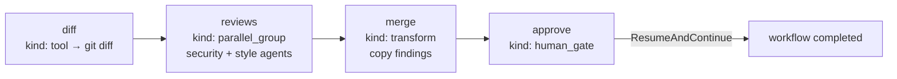

---

## 关键代码索引

| 阶段 | 文件 | 核心函数 |
|------|------|----------|
| YAML 加载 | `internal/adapter/config/yaml/config.go` | `LoadFile` |
| Skills 展开 | `internal/application/scenario/builder.go` | `expandSkills`, `expandWorkflowSkillNodes` |
| Run 分发 | `framework.go` | `Framework.Run` |
| 自主模式 | `internal/application/runtime/runtime.go` | `Engine.Run`, `answer` |
| LLM+Tool 循环 | `internal/application/runtime/runtime_llm.go` | `answerWithToolsFrom` |
| Tool 执行 | `internal/application/runtime/runtime_tools.go` | `dispatchTool` |
| Workflow | `internal/application/orchestration/workflow.go` | `WorkflowRunner.Run`, `runNode` |
| Hybrid 恢复 | `framework_continue.go` | `ResumeAndContinue`, `continueHybridRun` |
| 事件触发 | `framework_event.go` | `HandleEvent` |
| LLM 接口 | `pkg/llm/types.go` | `Gateway`, `ToolCaller`, `StructuredOutputter` |
| HITL Gate | `internal/adapter/human/cli/gate.go` | `Pause`, `Resume` |
| 上下文窗口 | `pkg/contextwindow/manager.go` | `Manager.Prepare` |
