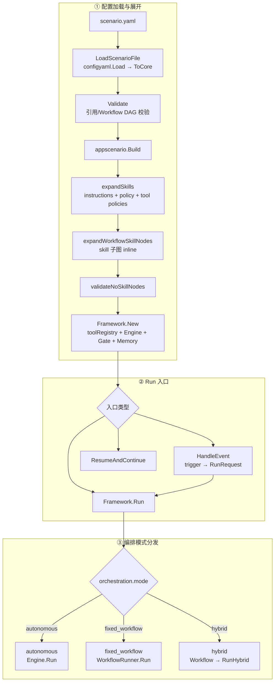
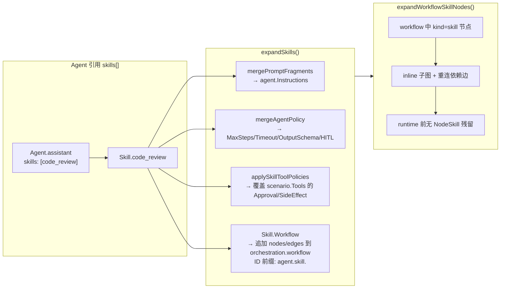
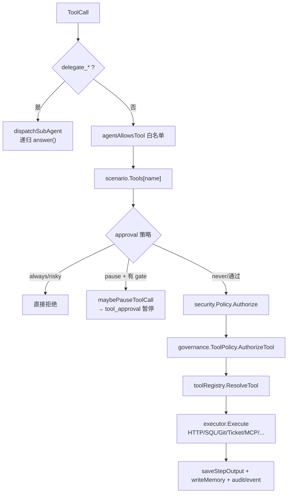
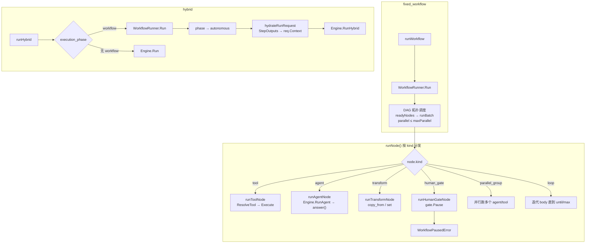
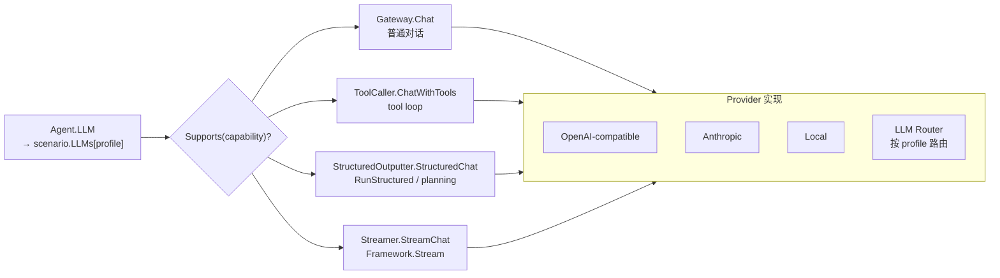
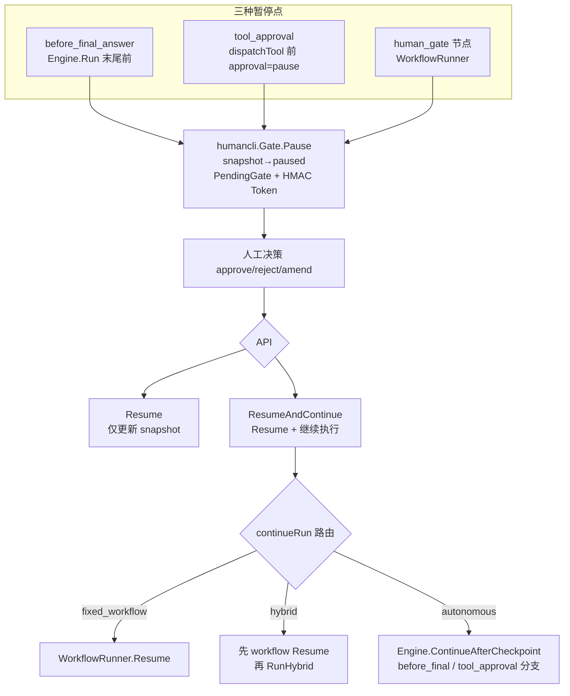
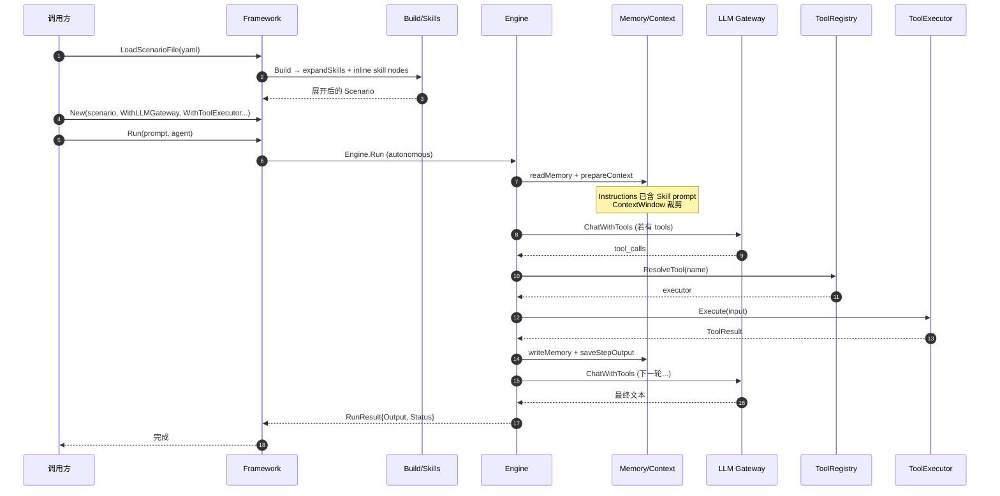
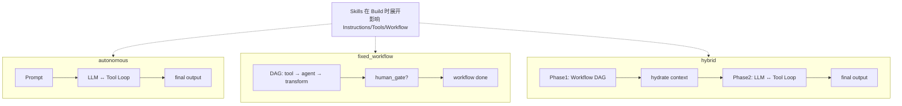
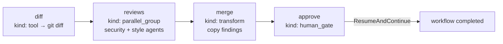

# Agent 编排逻辑流程图

本文档描述 agentflow-go 从 Scenario YAML 加载到 Run 完成的完整执行链路，涵盖 **Skills 展开、LLM 调用、Tools 执行、三种编排模式、HITL 暂停/恢复**。

相关代码入口见文末「关键代码索引」。

---

## 一、总览：从 YAML 到 Run 完成

---

## 二、Skills 展开逻辑（Build 阶段）

Skills **不是运行时 Actor**，而是在 `Build` 时**编译进 Scenario**：

**要点：**

- Skill → **Prompt 片段 + Agent 策略 + Tool 策略 + 可选 Workflow 子图**
- Workflow 里的 `skill` 节点在 Build 时展开，运行时只认识 `tool / agent / human_gate / ...`

---

## 三、Autonomous 模式：LLM + Tools 核心循环

```mermaid
flowchart TB
    START["Engine.Run"] --> SNAP["创建/保存 RunSnapshot<br/>status=running"]
    SNAP --> AGENT["resolveAgent(req.Agent)"]
    AGENT --> HITL1{"HITL enabled?<br/>before_final_answer"}
    HITL1 -->|是| PAUSE1["gate.Pause → Paused + Token"]
    HITL1 -->|否| ANSWER["Engine.answer"]

    subgraph ANSWER_BLOCK["answer() 内部"]
        MEM["readMemory<br/>按 scope 读历史消息"]
        CTX["prepareContext<br/>system + memory + context JSON + prompt"]
        CW["contextwindow.Manager.Prepare<br/>滑动窗口/压缩 tool 结果"]
        PLAN{"planning.enabled?"}
        PLAN_INJ["injectAutonomousPlan<br/>LLM 生成 plan → 注入 system"]
        BRANCH{"agent 有 tools/sub_agents<br/>且 LLM 支持 CapToolCall?"}

        MEM --> CTX --> CW --> PLAN
        PLAN -->|是| PLAN_INJ --> BRANCH
        PLAN -->|否| BRANCH

        BRANCH -->|否| CHAT["chatWithRetry → llm.Chat"]
        BRANCH -->|是| LOOP["answerWithToolsFrom<br/>最多 maxSteps 轮"]

        subgraph TOOL_LOOP["Tool Loop"]
            L1["prepareMessages"]
            L2["llm.ChatWithTools"]
            L3{"有 tool_calls?"}
            L4["dispatchTool"]
            L5["append tool result → 下一轮"]
            L1 --> L2 --> L3
            L3 -->|否| DONE["返回最终文本"]
            L3 -->|是| L4 --> L5 --> L1
        end

        LOOP --> TOOL_LOOP
        CHAT --> WRITEMEM["writeMemory"]
        DONE --> WRITEMEM
    end

    ANSWER --> ANSWER_BLOCK
    WRITEMEM --> FINAL["StepOutputs[final]<br/>status=completed"]
```

### dispatchTool 完整链路

**Tool 解析优先级**（`toolRegistry.ResolveTool`）：

1. `WithToolExecutor` 显式注册（eager）
2. 缓存（cache）
3. `WithToolResolver` 动态解析

---

## 四、Fixed Workflow / Hybrid 模式

**Workflow 与 Autonomous 的区别：**

| | fixed_workflow / hybrid（阶段 1） | autonomous |
|---|---|---|
| 调度 | DAG 节点顺序/并行/条件边 | LLM 自主决定 tool_calls |
| LLM | 仅在 `agent` 节点调用 | 每轮 answer/tool loop |
| Tool | `runToolNode` 直接 Execute | `dispatchTool` 经 LLM 决策 |
| 输出 | 各 step 写入 `StepOutputs[nodeID]` | `StepOutputs["final"]` + `tool.*` |

---

## 五、LLM Gateway 调用链

**消息组装顺序**（`prepareContext`）：

1. `system`: agent.Instructions（已含 Skill 展开的 prompt）
2. memory 历史（受 `memory_recall_limit` 限制）
3. `user`: Runtime context JSON（hybrid 阶段 2 含 workflow step outputs）
4. `user`: prompt

---

## 六、HITL 暂停与恢复

---

## 七、端到端时序（Autonomous + Tools + Skill 已展开）

---

## 八、三种模式对比

---

## 九、实例：`code_review_pipeline.yaml`

`examples/code_review_pipeline.yaml` 是 **fixed_workflow** 模式，对应第四节节点调度：

---

## 关键代码索引

| 阶段 | 文件 | 核心函数 |
|------|------|----------|
| YAML 加载 | `internal/adapter/config/yaml/config.go` | `LoadFile` |
| Skills 展开 | `internal/application/scenario/builder.go` | `expandSkills`, `expandWorkflowSkillNodes` |
| Run 分发 | `framework.go` | `Framework.Run` |
| 自主模式 | `internal/application/runtime/runtime.go` | `Engine.Run`, `answer` |
| LLM+Tool 循环 | `internal/application/runtime/runtime_llm.go` | `answerWithToolsFrom` |
| Tool 执行 | `internal/application/runtime/runtime_tools.go` | `dispatchTool` |
| Workflow | `internal/application/orchestration/workflow.go` | `WorkflowRunner.Run`, `runNode` |
| Hybrid 恢复 | `framework_continue.go` | `ResumeAndContinue`, `continueHybridRun` |
| 事件触发 | `framework_event.go` | `HandleEvent` |
| LLM 接口 | `pkg/llm/types.go` | `Gateway`, `ToolCaller`, `StructuredOutputter` |
| HITL Gate | `internal/adapter/human/cli/gate.go` | `Pause`, `Resume` |
| 上下文窗口 | `pkg/contextwindow/manager.go` | `Manager.Prepare` |
