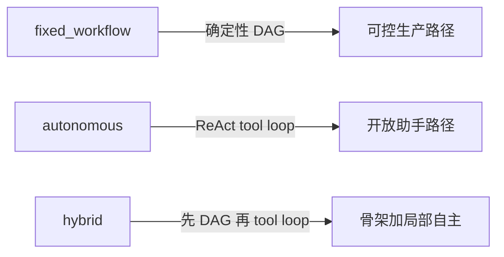
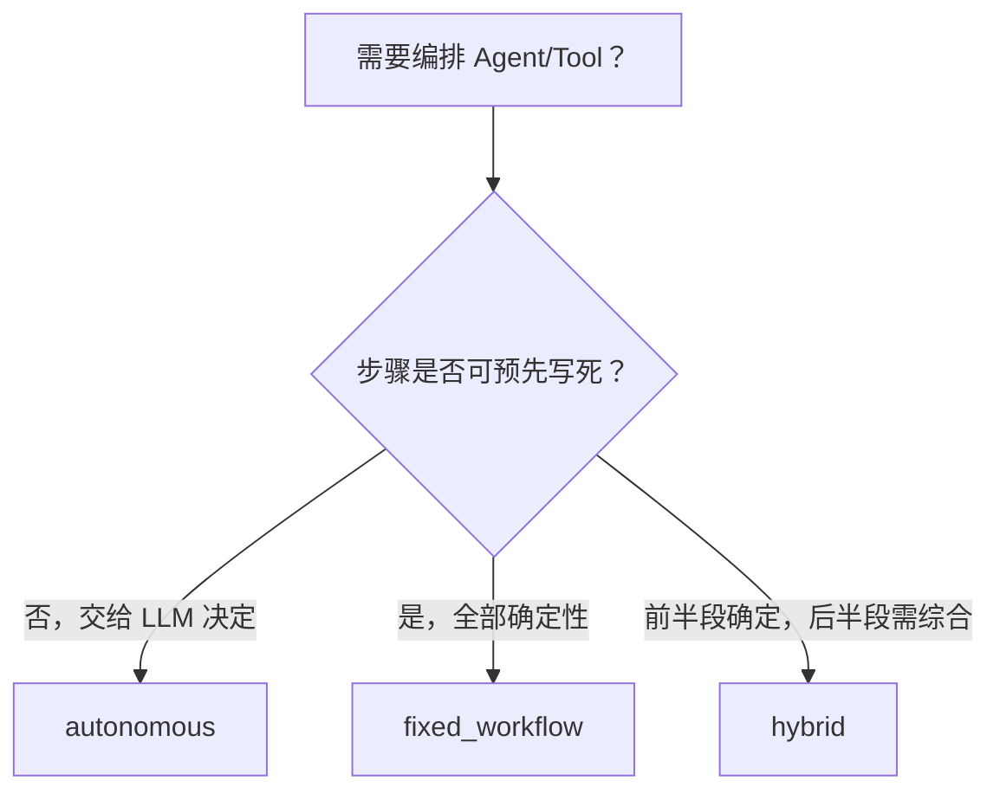

# 三模式编排：设计理由与选型指南

本文固化 `autonomous` / `fixed_workflow` / `hybrid` 的**架构立场**：为何保留、何时选用、什么时候再投入扩面。

执行链路细节见 [orchestration-flow.md](./orchestration-flow.md)；投资优先级见 [product-direction.md](./product-direction.md)。

---

## 1. 结论（先读这段）

| 问题 | 答案 |
|------|------|
| 三模式有没有必要？ | **作为框架扩展模型有必要**；作为「每种都打磨到同样深」没必要。 |
| 是不是业界主流？ | **Workflow ↔ Agent 光谱是主流**；「三个 mode 枚举」是本库的显式化，LangGraph 等多用统一图表达同一光谱。 |
| 宿主只用 autonomous 怎么办？ | **正常**。默认推荐与承诺深度 = `autonomous`；另两模式是已实现的扩展能力。 |
| 要不要删掉 fixed / hybrid？ | **不建议删**。应 **冻结扩面 + 缩默认 CI/catalog**，等触发条件再开预算。 |

不合理的不是三模式本身，而是把三种模式当成**同等权重的产品主线**去扩张（新节点、新 catalog、Studio 多场景）。

---

## 2. 业界光谱与本库映射

主流不是「必须做成三个 mode 枚举」，而是：

| 光谱一端 | 光谱另一端 |
|----------|------------|
| **Workflow**：步骤预定义，LLM/工具是节点 | **Agent**：模型自主决定下一步调用什么 |
| 可预测、可测、可审计、成本可控 | 灵活、适合探索与开放工具集 |

本库显式拆成三个入口（对 Go 嵌入式库更清晰）：



| 模式 | 主流对应 | 典型场景 |
|------|----------|----------|
| `autonomous` | ReAct / tool-calling agent | 助手、开放工具、探索任务 |
| `fixed_workflow` | 确定性 DAG / pipeline | 审批、RAG 闭环、多步固定质检 |
| `hybrid` | 「先固定后自主」组合 | 多专家分析 → lead 综合；预处理 → 开放问答 |

**刻意非目标**：不做图内完整 `agent_loop` 节点（用 `hybrid` + `autonomous` 代替），避免两套循环语义纠缠。见 [product-direction.md](./product-direction.md)。

---

## 3. 一分钟选型



| 你的目标 | 推荐 mode | 备注 |
|----------|-----------|------|
| 开放式问答、动态 tool 选择 | `autonomous` | **默认路径**；当前产品承诺深度 |
| 预先写死的 DAG / 合规门禁 | `fixed_workflow` | 扩展能力；无触发条件前不扩新节点 |
| 先结构化步骤，再 LLM 综合 | `hybrid` | 扩展能力；保持能跑通即可 |

节点级细节与示例栈见 [orchestration-flow.md §九](./orchestration-flow.md#九编排模式与节点选型指南)。

**避免**：为了用图而用图。若问题开放、工具集动态，优先 `autonomous` + HITL / 工具审批，而不是硬造 DAG。

---

## 4. 投资优先级（现在 vs 未来）

```text
现在（默认宿主）        近期扩展面              远期（触发条件命中后再开）
─────────────────      ─────────────────      ─────────────────────
autonomous 做深        hybrid 保持能跑通        fixed_workflow 节点/案例
HITL / StreamRun       文档写清选型             Studio 多场景体验
治理 / context         不新增 RAG/审批节点      杀手级 workflow 案例
```

优先级：**Autonomous > Hybrid 骨架 > Fixed DAG 扩面**。

- `fixed_workflow` / `hybrid` = **已实现的 capability**，不是当前迭代主战场。
- 新 workflow 节点、新 RAG/审批 catalog、Studio 多场景扩面 → **Frozen**，直到第 5 节触发条件命中。

与长事务调度（Temporal 等）的差异化：继续放在 **LLM / HITL / Memory / 时间旅行是一等公民**，不跟 Temporal 拼 exactly-once 调度。

---

## 5. 激活 fixed_workflow / hybrid 投入的触发条件

满足**任一**再开预算（新节点、新案例、默认 CI 强校验、Studio 多场景）：

1. 产品出现**强确定性**需求：多步审批、固定 RAG 闭环、合规必须可回放的 DAG。
2. 需要「先并行专家再综合」，且不愿在宿主层手写两段 `Run`。
3. 有明确客户要以 workflow 图交付，而不是无限 tool loop。

在此之前：文档与叙事标明「扩展能力 / 待激活」；默认 CI 只强校验 [CoreCatalog](../pkg/builder/catalog.go)（autonomous 核心）。

---

## 6. Catalog 与 CI 治理

| 表面 | API / 命令 | 含义 |
|------|------------|------|
| 默认强校验 | `builder.CoreCatalog()` · `make validate-builder` | autonomous 核心栈 |
| 完整示例（含 workflow/hybrid） | `builder.ExampleCatalog()` · `validate -kind builder full` | 文档与发现；扩面冻结 |
| Legacy 子集 | `builder.LegacyCatalog()` | fixed_workflow / hybrid / RAG 等 |

新增 catalog 栈：默认只接受 **CoreCatalog 方向**（autonomous 深度）。Legacy 方向新增需先对照第 5 节触发条件。
